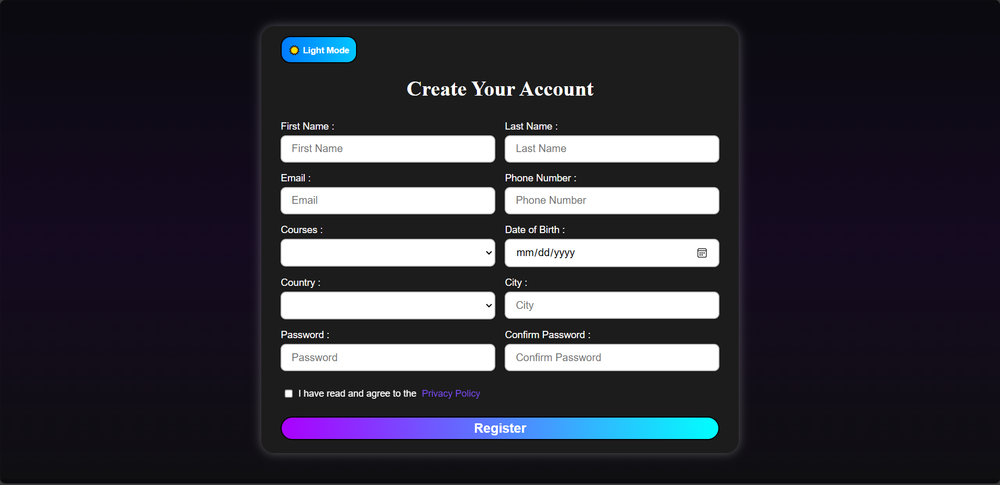

# Signup Form (JavaScript Day 1)
### 🌐 Live Demo  
👉 [Sign-Up Form]((https://sign-up-form-lilac-iota.vercel.app))

A modern and fully dynamic **Signup Form** created **purely with JavaScript DOM manipulation**, styled using **CSS for responsiveness**.  
No static HTML file was written — every element was created, styled, and managed using JavaScript!

---

## 🚀 Features
✅ Fully dynamic form generated with JavaScript (no HTML used)  
✅ Dark & Light theme toggle (🌙 / ☀️)  
✅ Responsive design with clean UI  
✅ Input validation (Empty fields + Password confirmation)  
✅ Modern gradient backgrounds and hover animations  
✅ Console logging for user data after successful registration  
✅ Lightweight — no libraries or frameworks used  

---

## 🧱 Tech Stack & Architecture
- **Frontend:** JavaScript (DOM API) + CSS (Responsive)
- **Dynamic Elements:** Created via `document.createElement()` and styled via JS
- **Theme Toggle:** Handled via event listeners and CSS variables  
- **Validation Logic:**
  - Checks empty fields  
  - Confirms password match  
  - Displays alerts + logs details in console  

---

## 🧠 How It Works
1. The entire form (inputs, labels, buttons, etc.) is generated using JavaScript.  
2. A “Dark Mode / Light Mode” button allows instant UI switching.  
3. The form validates input before submission — if successful, it shows a success alert.  
4. User information (except passwords) is displayed in the browser console.

---

## 💡 Learning Goals
This project helps you master:
- DOM Manipulation  
- Event Handling  
- Conditional Logic  
- Dynamic Styling with JavaScript  
- Responsive UI Design  

---

## 📸 Preview

---

## 🛠️ Developer Info
👨‍💻 **Developer:** Kabeer Hussain  
📘 **Series:** JavaScript — *30 Days, 30 Projects*  
📆 **Day:** 1 — *Signup Form using DOM*  
📧 **Email:** codealpha0786@gmail.com  
🔗 **GitHub:** [ITechKabeer](https://github.com/ITechKabeer)

Made by Kabeer Hussain ❤️ || Mern Stack Learner

